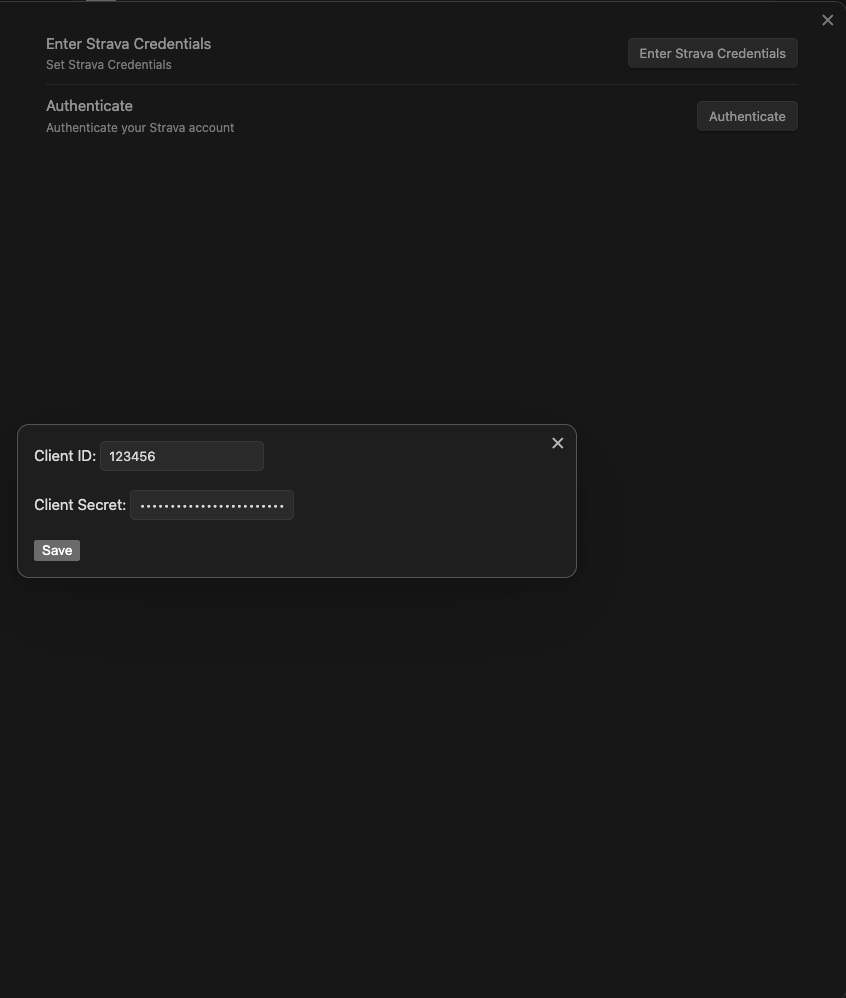
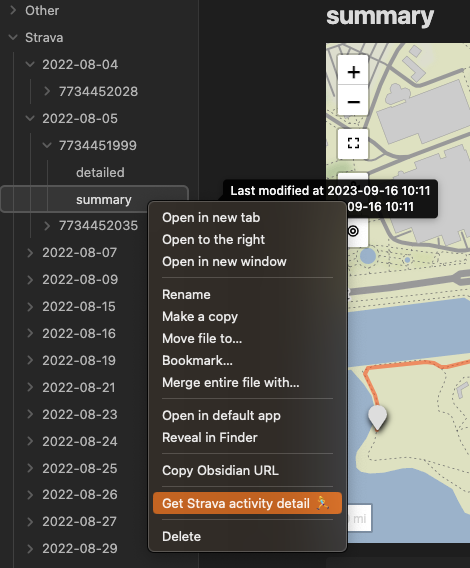
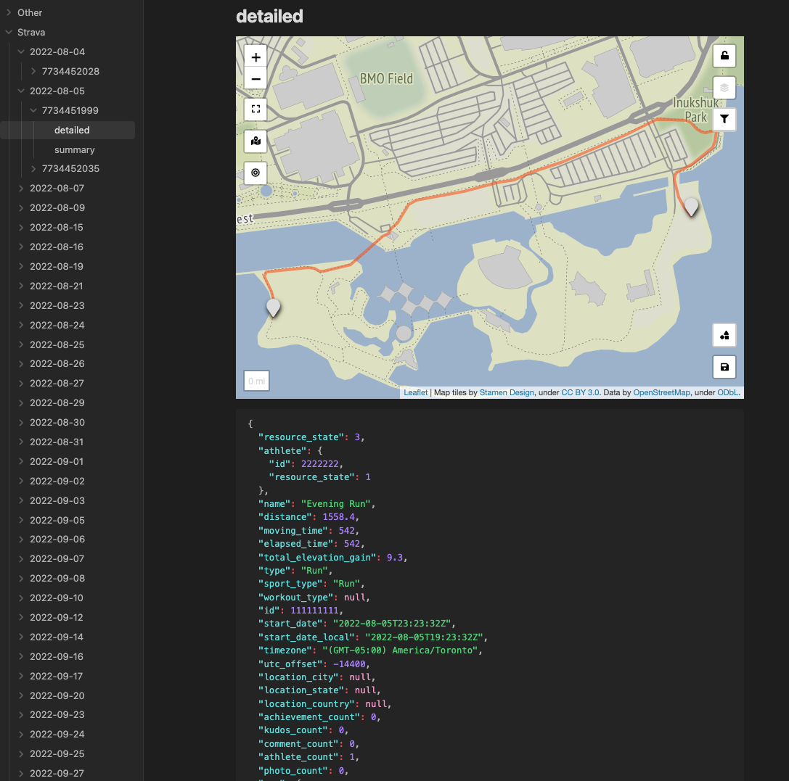
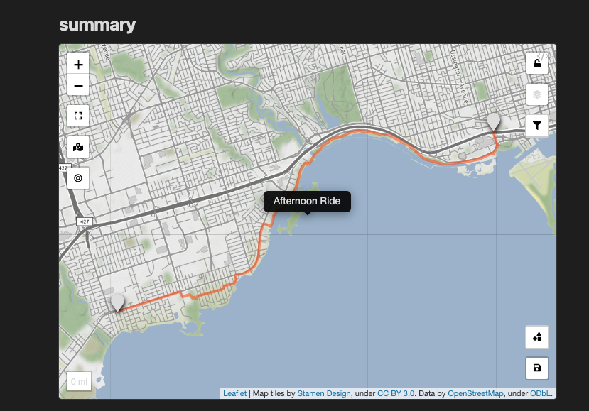

# Strava Activities Plugin for Obsidian

This plugin enables downloading and visualizing your Strava activities to your Obsidian vault.

## Usage

1. Install the plugin to your Obsidian vault.
1. To use this plugin in your Obsidian vault, you first need to enable API access to your own Strava account. Login to your Strava account on your browser and head over to the following URL https://www.strava.com/settings/api and create your API application. Some steps are detailed here https://developers.strava.com/docs/getting-started/. Use the following values:

    ```yaml
    Category: Other
    Website: https://github.com/saadsaifse/strava-obsidian
    Authorization Callback Domain: obsidianforstrava
    ```

    Once created, note your `Client ID` and `Client Secret`. We will enter these values once in the plugin settings.
1. Head over to the plugin settings and enter your Strava Client ID and Client Secret and click on Save.
1. Click on the Authenticate button. It will take you to your browser to finish the OAuth process. After authorizing, you will be redirected to your Obsidian app.

2. Now, simply click on the `Synchronize Strava Activities` button on the left ribbon icon, to download all your Strava activities to your vault.

## Functionalities

1. Download the summary of all your Strava activities
2. Download the details of all your Strava activities. The details include segment information, etc. Details are not downloaded automatically. Instead there is a context menu upon right clicking on the summary files to fetch the details of that activity. This is because there is a limit on the free Strava API usage.


1. Activities are stored based on the following directory structure.
   ```
   Vault
      Strava
          Activity Date e.g. 2023-09-17
              Activity ID e.g. 0123456789
                  summary.md
                  detail.md (this file is created when user sends a command)
                  map.geojson (this file is created to store the polyline information for activities with location data. Hidden from the vault, but exists on the filesystem)
   ```
2. Visualize your activities with maps data e.g., runs, rides, etc. on a leaflet map. For this to work, just install the Obsidian Leaflet plugin to your vault.

1. The last downloaded date and time is remembered in order to only download the newer activities. Just click on the `Synchronize Strava Activities` to download newer activities.


## Known Bugs

1. The leaflet map doesn't open centered. This is a bug in the Obsidian Leaflet plugin. Until that's fixed, please click on the Reset Zoom button on the left of map to zoom to the activity map.

## Funding URL

Hi 👋🏼, if I made your life easier, consider buying me a coffee :) https://www.buymeacoffee.com/saadsaif


## Developing

Quick starting guide for new plugin devs:

- Install NodeJS, then run `npm i` in the command line under the repo folder.
- Run `npm run dev` to compile the plugin from `main.ts` to `main.js`.
- Make changes to `main.ts` (or create new `.ts` files). Those changes should be automatically compiled into `main.js`.
- Reload Obsidian to load the new version of your plugin. Or use the hot reload plugin to load changes as they occur https://github.com/pjeby/hot-reload.
- Enable plugin in settings window.

## Releasing

- Update your `manifest.json` with your new version number, such as `1.0.1`, and the minimum Obsidian version required for your latest release.
- Update your `versions.json` file with `"new-plugin-version": "minimum-obsidian-version"` so older versions of Obsidian can download an older version of your plugin that's compatible.
- Create new GitHub release using your new version number as the "Tag version". Use the exact version number, don't include a prefix `v`. E.g.,
  ```
  git tag -a 1.0.0 -m "1.0.0"
  git push origin 1.0.0
  ```
- Github actions will execute upon pushing a new tag and will create a draft release on Github.
- Specify release notes on github and publish the release.

> You can simplify the version bump process by running `npm version patch`, `npm version minor` or `npm version major` after updating `minAppVersion` manually in `manifest.json`.
> The command will bump version in `manifest.json` and `package.json`, and add the entry for the new version to `versions.json`

## Manually installing the plugin

- Copy over `main.js`, `styles.css`, `manifest.json` to your vault `VaultFolder/.obsidian/plugins/your-plugin-id/`.

## Obisdian API Documentation

See https://github.com/obsidianmd/obsidian-api
